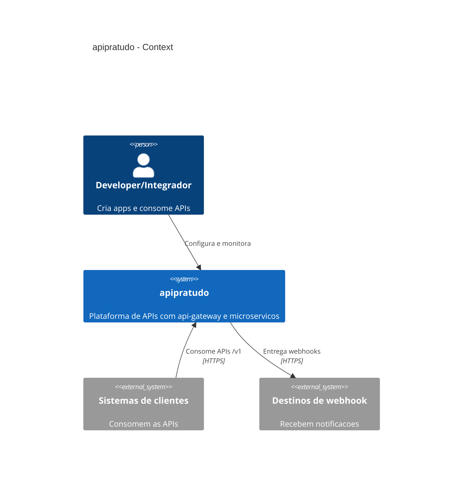
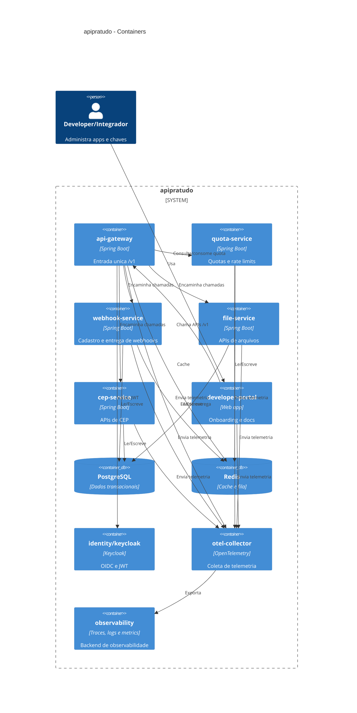
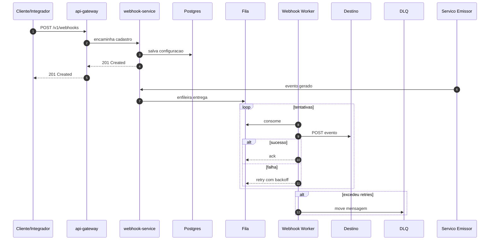

# Diagramas

O GitHub renderiza Mermaid por padrao. Localmente, use mermaid-cli ou uma extensao Mermaid Preview.

## C4 Context

```mermaid
C4Context
title apipratudo - Context

Person(integrator, "Developer/Integrador", "Cria apps e consome APIs")
System(apipratudo, "apipratudo", "Plataforma de APIs com api-gateway e microservicos")
System_Ext(client_systems, "Sistemas de clientes", "Consomem as APIs")
System_Ext(webhook_targets, "Destinos de webhook", "Recebem notificacoes")

Rel(integrator, apipratudo, "Configura e monitora")
Rel(client_systems, apipratudo, "Consome APIs /v1", "HTTPS")
Rel(apipratudo, webhook_targets, "Entrega webhooks", "HTTPS")
```

## C4 Container

```mermaid
C4Container
title apipratudo - Containers

Person(integrator, "Developer/Integrador", "Administra apps e chaves")

System_Boundary(apipratudo, "apipratudo") {
  Container(api_gateway, "api-gateway", "Spring Boot", "Entrada unica /v1")
  Container(quota_service, "quota-service", "Spring Boot", "Quotas e rate limits")
  Container(webhook_service, "webhook-service", "Spring Boot", "Cadastro e entrega de webhooks")
  Container(file_service, "file-service", "Spring Boot", "APIs de arquivos")
  Container(cep_service, "cep-service", "Spring Boot", "APIs de CEP")
  Container(dev_portal, "developer-portal", "Web app", "Onboarding e docs")

  ContainerDb(postgres, "PostgreSQL", "Dados transacionais")
  ContainerDb(redis, "Redis", "Cache e fila")

  Container(identity, "identity/keycloak", "Keycloak", "OIDC e JWT")
  Container(otel_collector, "otel-collector", "OpenTelemetry", "Coleta de telemetria")
  Container(observability, "observability", "Traces, logs e metrics", "Backend de observabilidade")
}

Rel(integrator, dev_portal, "Usa")
Rel(dev_portal, api_gateway, "Chama APIs /v1")

Rel(api_gateway, identity, "Valida JWT")
Rel(api_gateway, quota_service, "Consulta/consome quota")
Rel(api_gateway, webhook_service, "Encaminha chamadas")
Rel(api_gateway, file_service, "Encaminha chamadas")
Rel(api_gateway, cep_service, "Encaminha chamadas")

Rel(webhook_service, postgres, "Le/Escreve")
Rel(file_service, postgres, "Le/Escreve")
Rel(cep_service, postgres, "Le/Escreve")
Rel(quota_service, redis, "Le/Escreve")
Rel(webhook_service, redis, "Fila de entrega")
Rel(api_gateway, redis, "Cache")

Rel(api_gateway, otel_collector, "Envia telemetria")
Rel(webhook_service, otel_collector, "Envia telemetria")
Rel(quota_service, otel_collector, "Envia telemetria")
Rel(file_service, otel_collector, "Envia telemetria")
Rel(cep_service, otel_collector, "Envia telemetria")
Rel(dev_portal, otel_collector, "Envia telemetria")
Rel(otel_collector, observability, "Exporta")
```

## Webhook delivery

```mermaid
sequenceDiagram
  autonumber
  participant Client as Cliente/Integrador
  participant Gateway as api-gateway
  participant Webhook as webhook-service
  participant DB as Postgres
  participant Queue as Fila
  participant Worker as Webhook Worker
  participant Target as Destino
  participant DLQ as DLQ
  participant Source as Servico Emissor

  Client->>Gateway: POST /v1/webhooks
  Gateway->>Webhook: encaminha cadastro
  Webhook->>DB: salva configuracao
  Webhook-->>Gateway: 201 Created
  Gateway-->>Client: 201 Created

  Source->>Webhook: evento gerado
  Webhook->>Queue: enfileira entrega

  loop tentativas
    Worker->>Queue: consome
    Worker->>Target: POST evento
    alt sucesso
      Worker-->>Queue: ack
    else falha
      Worker-->>Queue: retry com backoff
    end
  end

  alt excedeu retries
    Worker->>DLQ: move mensagem
  end
```
